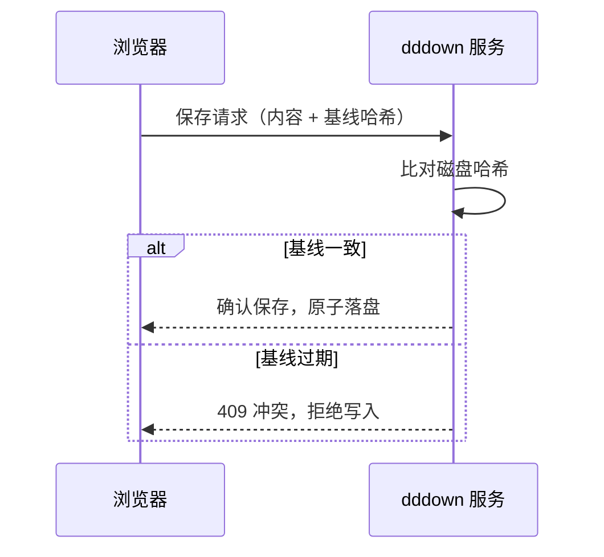

# 欢迎使用 dddown

你好，写作者。

你能看到这份文档，说明这是你第一次打开 dddown。它是一份欢迎信，也是一份排版演示——后半段几乎覆盖了 Markdown 的全部语法，你可以一边读，一边在编辑区里改动它们，看右侧预览实时变化。

先说说 dddown 是什么：一个本地优先的 Markdown 编辑器。Rust 写的后端跑在你自己的机器上，笔记就是磁盘上一个个普通的 `.md` 文件，没有私有格式，没有账号，没有云端，没有任何锁定。关掉 dddown，你的文字还在原处，任何文本编辑器都能打开它们。

它的能力大致是：双栏实时预览、行内渲染（光标离开的一行就地变成渲染效果）、代码高亮、数学公式、Mermaid 图表、`[[双链]]` 跳转、全文搜索、主题与字体切换、HTML 与 PDF 导出、自动保存与冲突检测。都是写作里真正用得上的东西，不多，但每一样都打磨过。

它不试图成为办公软件，也不涉足多人协作与知识图谱。它只把一件事做对：让你在自己的机器上，舒服而安心地写字。功能克制是有意为之——写作工具上多出来的每一个按钮，都是对注意力的一次微征收。

## 为什么做 dddown

这一节是创建者想对你说的话。

我不知道编辑器的市场如今算不算红海。但我始终相信，一个与电脑打交道的人，对文字编辑器天生是好奇的，也是乐于尝试的。编辑器层出不穷地出现，也许恰好佐证了一件事：用户对编辑器其实没有忠诚度——喜欢上哪一个就用哪一个，也容易贪新厌旧。在我看来，这恰恰是机会。

支撑我做这件事的，还有一个更底层的东西：我自己喜欢美的编辑器。只有美，才能让人真正沉浸在一件工具里。Typora 已经足够美了，我由衷欣赏它；但我想要一种更真实的美——更轻量，更方便，更符合中国用户的书写气质。

所以这个项目开始了，而我至今仍在不断调整它的每一个使用细节。它基于 Rust 开发：天然可控、极致轻量，是我选择 Rust 的第一原因；我也始终认为，在大模型时代，Rust 会是未来最受青睐的语言，甚至没有之一。

工程上，dddown 完全复用 Rust 社区成熟的库，不重复造轮子。我所做的，只是以我心中「Markdown 编辑器应有的美」为标准，一遍遍打磨体验。这个标准当然很主观——所以真诚地欢迎使用 dddown 的你，一起来共建。

## 快速上手

几个马上能用上的操作，所有快捷键都能在 config.toml 里按自己的习惯改写：

- **侧栏**：`⌘⇧E` 收起或展开侧栏。文件树里可以新建、删除笔记；顶部输入框直接敲文件名回车即新建
- **全文搜索**：`⌘P` 呼出搜索面板，输入即查，覆盖工作区所有笔记
- **主题切换**：`⌘⇧T` 在书卷亮、书卷暗、现代亮、现代暗之间循环；字体用 `⌘⇧F` 在宋体与无衬线之间切换，偏好会自动记住
- **专注模式**：`⌘⇧D`，当前段落高亮、其余淡化，适合深夜写作
- **行内渲染**：光标离开某一行，该行就地渲染——公式、图片、链接、粗体；光标落回即恢复源码，这是 Typora 式的交互
- **导出**：设置面板 → 导出，或 `⌘⇧X`。HTML 完全自包含可离线打开，PDF 带页眉页脚与标题编号
- **自动保存**：停止输入半秒后自动落盘，无需 `⌘S`；多个窗口改同一文件会被冲突检测拦下，不会互相覆盖

## 全格式排版演示

下面开始是格式样本。建议对照编辑区源码与右侧预览阅读，再导出一份 PDF 看看印刷效果。

### 行内样式

**粗体**用于强调关键结论，*斜体*用于术语与外来词，***粗斜体***用于双重强调，~~删除线~~标记废弃内容，`行内代码`用于变量与命令。这些样式可以任意嵌套，例如**粗体内含`代码`与*斜体***，渲染引擎必须正确处理嵌套边界。

中文排版与西文不同：段落不首行缩进，靠段间距分隔；标点采用全角，引号用「」与『』。混排时汉字与西文之间的空隙由渲染层自动调节，这就是所谓的「盘古之白」。

### 标题层级

PDF 导出时，一至三级标题会自动编号（如本文档的 1、2、3 与 4.1），并施加「不孤悬」约束——标题不会单独留在页底。四级及以下不参与编号：

#### 四级标题示例

##### 五级标题示例

###### 六级标题示例

六级是最深层级，字号与正文接近，仅以灰度区分。

### 列表

- 无序列表第一项：记录灵感
- 无序列表第二项：整理素材
  - 嵌套子项：按主题归档
    - 三级嵌套：来源可靠性分级
- 无序列表第三项：成文发布

1. 有序列表第一步：明确问题
2. 有序列表第二步：拆解约束
   1. 嵌套有序：识别硬约束
   2. 嵌套有序：识别软约束
3. 有序列表第三步：给出方案
   - 混排子项：方案用无序列表展开
   - 混排子项：每个方案附代价分析

任务清单：

- [x] 安装 dddown
- [x] 读完这份欢迎文档
- [ ] 写下第一篇笔记
- [ ] 把 dddown 推荐给朋友

### 引用与提示框

> 好的排版是隐形的。读者注意不到它的存在，只感觉到阅读顺畅；一旦排版出了问题，所有人都会立刻察觉。
>
> —— 某位不愿透露姓名的字体设计师

提示框（Callout）是语义化引用，dddown 支持全部五种：

> [!NOTE]
> 普通备注：用于补充说明，不影响主线阅读。

> [!TIP]
> 技巧提示：行内渲染遇到不听话的格式时，把光标移到那一行，源码就回来了。

> [!IMPORTANT]
> 重要信息：自动保存在停止输入半秒后触发，关页时还有兜底写入，放心打字。

> [!WARNING]
> 警告：多个窗口同时编辑同一文件会触发冲突检测，后保存者会被拒绝写入。

> [!CAUTION]
> 危险操作：删除文件不可撤销，请在删除前确认已备份。

### 表格

| 功能 | 快捷键 | 备注 |
|---|---|---|
| 全文搜索 | ⌘P | 输入即查 |
| 主题切换 | ⌘⇧T | 四主题循环 |
| 字体切换 | ⌘⇧F | 宋体 / 无衬线 |
| 专注模式 | ⌘⇧D | 段落聚光 |
| 侧栏收起 | ⌘⇧E | 沉浸写作 |

对齐方式由分隔行的冒号位置决定：

| 左对齐 | 居中对齐 | 右对齐 |
|:---|:---:|---:|
| 文本 | 文本 | 128 |
| 更长的文本内容 | 文本 | 4096 |
| `代码` | **粗体** | 1048576 |

表格内支持行内样式，PDF 导出时整表不跨页劈裂。

### 代码块

代码块由 Shiki 高亮，随主题亮暗切换。Rust 示例：

```rust
/// FNV-1a 64 位哈希：与前端逐字节一致，用于保存冲突检测
fn fnv1a64(bytes: &[u8]) -> u64 {
    let mut h: u64 = 0xcbf29ce484222325;
    for &b in bytes {
        h ^= b as u64;
        h = h.wrapping_mul(0x100000001b3);
    }
    h
}
```

Python 与 TypeScript：

```python
def paginate(paragraphs: list[str], capacity: int) -> list[list[str]]:
    """贪心分页：段落不拆分，容量耗尽即换页"""
    pages, current, used = [], [], 0
    for p in paragraphs:
        if used + len(p) > capacity and current:
            pages.append(current)
            current, used = [], 0
        current.append(p)
        used += len(p)
    if current:
        pages.append(current)
    return pages
```

```typescript
/** 防抖：停止输入 wait 毫秒后才执行，期间不断重置计时 */
export function debounce<T extends (...args: never[]) => void>(fn: T, wait: number): T {
  let timer: ReturnType<typeof setTimeout> | null = null;
  return ((...args: Parameters<T>) => {
    if (timer) clearTimeout(timer);
    timer = setTimeout(() => fn(...args), wait);
  }) as T;
}
```

Shell 与 JSON：

```bash
./target/release/dddown --workspace ~/Documents/Notes
```

```json
{
  "server": { "port": 60244, "workspace": "~/Documents/Notes" },
  "editor": { "font_size": 15, "tab_size": 2 }
}
```

### 数学公式

行内公式直接嵌入文字：质能方程 $E = mc^2$，欧拉恒等式 $e^{i\pi} + 1 = 0$，求和 $\sum_{i=1}^{n} i = \frac{n(n+1)}{2}$。

块级公式独占一行居中：

$$
x = \frac{-b \pm \sqrt{b^2 - 4ac}}{2a}
$$

$$
\int_{-\infty}^{\infty} e^{-x^2} \, dx = \sqrt{\pi}
$$

矩阵：

$$
\begin{pmatrix} a & b \\ c & d \end{pmatrix} \begin{pmatrix} x \\ y \end{pmatrix} = \begin{pmatrix} ax + by \\ cx + dy \end{pmatrix}
$$

### 图表

Mermaid 流程图：


Mermaid 时序图：



### 链接与双链

普通链接：[CommonMark 规范](https://commonmark.org)，[Rust 官网](https://rust-lang.org)。自动链接：<https://github.com>。双链跳转：[[全格式排版demo]]——把光标移过去点一下，笔记之间可以互相导航。

### 转义与特殊字符

反斜杠转义：\*这不是斜体\*，\#这不是标题。

HTML 实体：&amp; &lt; &gt; &copy; &mdash; &hellip;

符号混排：破折号——省略号……间隔号·书名号《》引号「」，箭头 → ← ⇒，货币 ¥ $ €，数学符号 ∀∃∂∇∞≈≠≤≥。

### 长文与分页

以下段落用于体验长文排版。导出的 PDF 会带页眉页脚与页码，标题自动编号，表格与代码块不被拦腰截断。

中文排版的审美核心在于「留白」与「节奏」。页面四周的页边距不是浪费，而是视线的呼吸空间；段落之间的空行不是缺失，而是语义的换气口。一份讲究的文档，正文密度应当均匀，既没有大片空白造成的空洞感，也没有密不透风造成的压迫感。

分页算法的职责是让内容在页面上自然流动，同时守住几条底线：标题不能单独留在页底，成为悬空的招牌；表格与代码块不能被拦腰截断，让读者在下一页寻找残缺的下文；段落的第一行不应独自留在页底，最后一行也不应孤零零地出现在页顶。这些规则在传统铅字排版中被称为「孤行控制」。

字体的选择决定了文档的气质。宋体源自雕版印刷，横细竖粗，起落笔有锋，适合长篇正文的沉静阅读；无衬线体去除了装饰性的笔锋，屏幕显示清晰利落。dddown 让两套配色与两套字体自由组合，偏好各自记忆，把选择权还给写作者。

页边距的取值也是一门平衡学问。太窄，文字顶到纸张边缘，显得局促；太宽，版面中央的文字块瘦长，浪费了纸张。dddown 的 PDF 导出采用约 22 毫米的均衡页边距，页眉页脚位于页边距区域内，与正文互不侵占，行内断行也会避开汉字与数字的视觉黏连处。

写作工具的最高境界是「消失」。当编辑器足够可靠，作者会忘记它的存在，只专注于思想的流淌；当排版足够讲究，读者会忘记格式的存在，只感受到阅读的顺畅。这正是 dddown 想要抵达的地方：所有格式各就各位，所有细节隐入背景，剩下的只有内容本身。

给刚上手的朋友一个朴素的建议：先写，再排版。写作时只管把想法倒出来，Markdown 的格式符号轻到几乎不打断思路；等初稿立住，再回头用标题理出骨架，用列表收拢要点，用加粗点醒关键句。格式是内容的仆人，不是相反。等你习惯了这套节奏，会发现写字与排版可以是同一件事的两面。

## 常见问题

### 我的笔记存在哪里？

就在启动时指定的工作空间目录里，每一个 `.md` 都是普通文本文件。你可以用访达直接浏览、复制、移动它们，dddown 不做任何包装与加密。备份就是拷贝目录，迁移就是拷贝目录，没有比这更简单的数据主权。

### 想换一个工作空间怎么办？

设置面板 → 工作空间 → 更改，选择任意目录即可热切换，无需重启；或者启动时用 `--workspace` 参数指定。切换前的笔记原封不动留在原目录里。

### 自动保存会丢东西吗？

写入采用临时文件加原子重命名，不会出现写一半的损坏文件；保存前先比对磁盘哈希，别的窗口改过的内容不会被静默覆盖，而是弹出冲突提示。你只管打字，剩下的交给 dddown。

### 我能参与共建吗？

当然。dddown 在 GitHub 上开源，欢迎提交问题反馈与改进建议。创建者说过，这个编辑器的打磨标准很主观——所以你的主观同样珍贵。

### 能装成桌面应用吗？

能。dddown 支持 PWA 安装：浏览器地址栏的安装入口，或 Safari 分享菜单里的「添加到程序坞」。装好后从启动台直接打开，独立窗口、秒开，体验更接近原生应用。

## 最后

这份文档随时可以删除，它不会打扰你的工作区。但如果你愿意留下它，它会是一份随查随用的语法参考。

往后的日子里，愿你在这里写下的每一个字都被妥帖安放。写作的快乐，从一张安静的桌面开始。

祝写作愉快。
